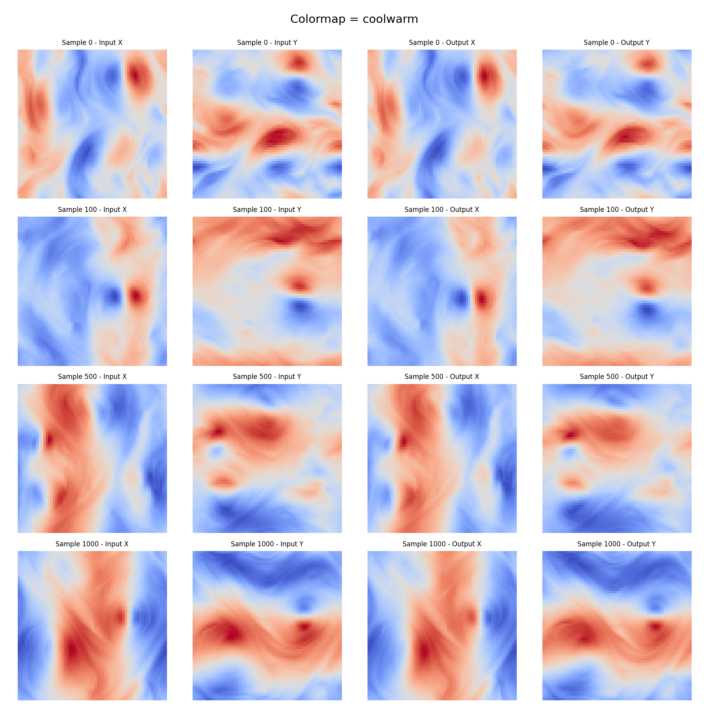
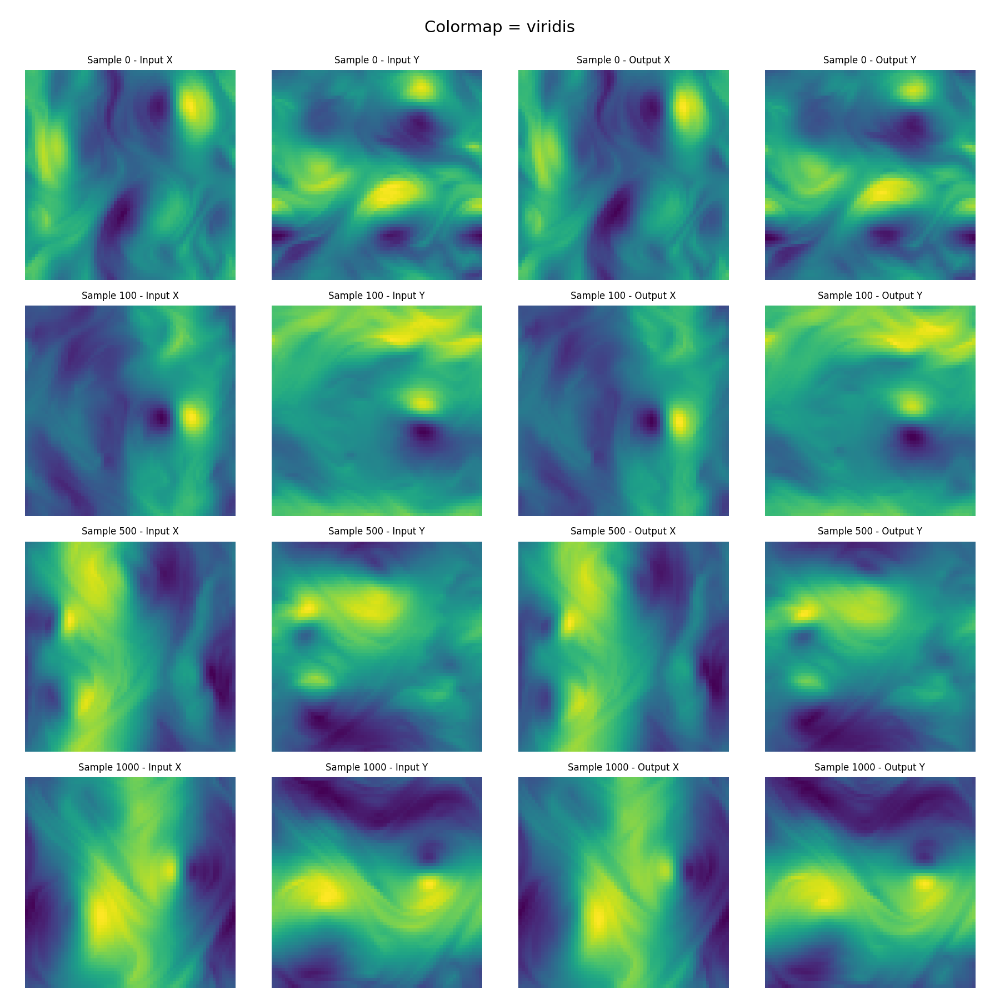
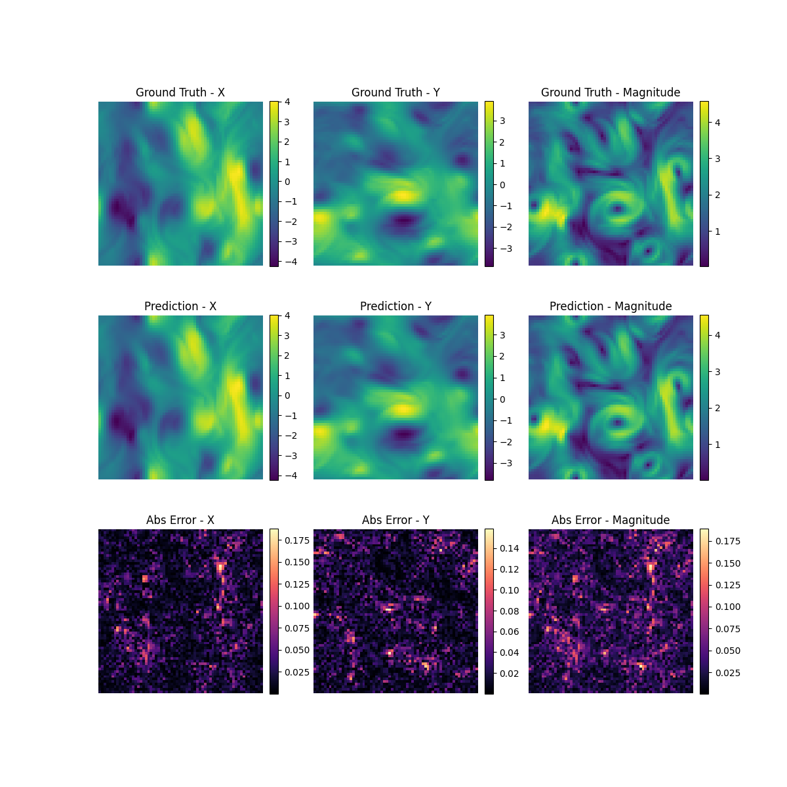

# Fourier Neural Operator for Kolmogorov Flow

This repository contains the implementation and analysis of a **Fourier Neural Operator (FNO)** trained to model the time evolution of Kolmogorov flow vector fields.

## 1\. Project Overview

  - **Task**: Next-step prediction of 2D vector fields.
  - [cite_start]**Dataset**: Kolmogorov flow, resolution $64 \times 64$, shape $(N, 2, 64, 64)$[cite: 11].
  - [cite_start]**Tools**: PyTorch, NeuralOperator library [cite: 32][cite_start], Matplotlib, Weights & Biases (WandB)[cite: 54].
  - [cite_start]**Key Capability**: Zero-shot generalization to higher resolutions ($128 \times 128$)[cite: 24].

## 2\. Methodology & Hyperparameters (Task 2 & 5)

The model uses the **FNO2d** architecture from the `neuraloperator` library. The FNO learns the operator in the frequency domain, allowing it to be discretization-invariant.

### Final Model Configuration


  - **Modes**: (32, 32)
  - **Hidden Channels**: 64
  - **Optimizer**: AdamW (`lr=1e-3`, `weight_decay=1e-4`)
  - **Scheduler**: StepLR (`step_size=20`, `gamma=0.7`)
  - [cite_start]**Loss Function**: LpLoss (Relative L2) [cite: 48, 51]
  - **Epochs**: 100

### Experiment Comparison

[cite_start]We compared a baseline configuration against the final tuned model to study the influence of hyperparameters[cite: 22]:

| Experiment | Modes | Width | Epochs | Scheduler | Test Loss (Rel L2) | Observation |
| :--- | :--- | :--- | :--- | :--- | :--- | :--- |
| **Baseline** | 16 | 64 | 50 | StepLR (step=10, $\gamma=0.5$) | \~1.65 | Underfitting; LR decayed too fast. |
| **Final Model** | **32** | **64** | **100** | **StepLR (step=20, $\gamma=0.7$)** | **\~0.90** | **Significant improvement.** Higher modes captured vortex boundaries better. |

> **WandB Project Log**: [View Run ck2efm3n](https://wandb.ai/estherhan5853-national-taiwan-university/FNO-Kolmogorov/runs/ck2efm3n?nw=nwuserestherhan5853)

## 3\. Training Results (Task 3)

The model was trained for 100 epochs. The training curve shows stable convergence after adjusting the learning rate scheduler.

| Metric | Value |
| :--- | :--- |
| **Final Train Loss** | \~0.75 |
| **Final Test Loss** | \~0.90 |
| **Optimizer** | AdamW |
| **Model Parameters** | \~2.3M 


## 4\. Visualizations & Error Analysis (Task 1 & 3)

### Prediction vs Ground Truth ($64 \times 64$)

The model successfully captures the complex structure of the vortices. 






### Vector Field Quiver (Input vs Prediction)


### Error Analysis

[cite_start]To identify where the model struggles, we computed the absolute error map ($|Target - Prediction|$) across the domain[cite: 20].

*(Generated by `visualize_error.py`)*



**Observations:**

  - **Localization**: Errors are primarily concentrated at the **boundaries of the vortices** (high-frequency regions).
  - **Magnitude**: While the structural patterns are correct, there are minor scale discrepancies contributing to the L2 loss.

## 5\. Resolution Tests (Zero-Shot Super-Resolution) (Task 6)

A key advantage of FNO is its ability to generalize to different spatial resolutions without retraining. We evaluated the model (trained on $64 \times 64$) on $32 \times 32$ and $128 \times 128$ inputs.

| Resolution | Test Loss | Observation |
| :--- | :--- | :--- |
| **32×32 (Downsample)** | \~1.50 | Loss increases due to loss of fine input details. |
| **128×128 (Upsample)** | **\~1.00** | **Excellent generalization.** The model produces smooth, physically consistent vector fields. |

*(Prediction on 128x128 resolution using bicubic interpolation for input)*

## 6\. Usage

### Requirements

  * `torch`
  * `neuraloperator`
  * `wandb`
  * `matplotlib`

### Running the Code

1.  **Train the model**:
    ```bash
    python train.py
    ```
2.  **Generate Visualizations (Error Map & Resolution Test)**:
    ```bash
    python visualize_error.py
    ```

### Checkpoint Download

To download the pre-trained model weights (`model_fno.pt`) from Google Drive:

```bash
./toy_task/download_checkpoint.sh
```
